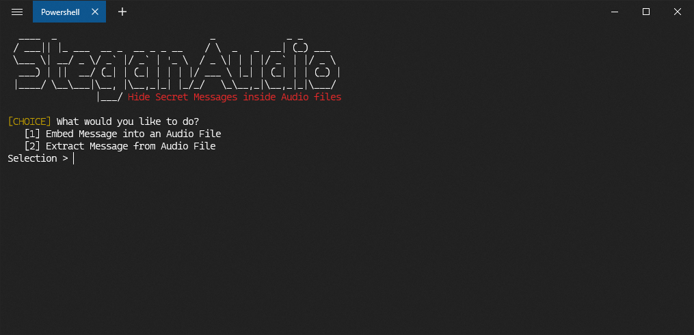

# SteganAudio

This is a Python3 Program to hide messages in Audio Files (currently only WAV Files are supported but I am working on other formats too). The tool is based on [HiddenWave](https://github.com/techchipnet/HiddenWave) by [TechChip](https://github.com/techchipnet).

The name "SteganAudio" is the concatenation of Steganography and Audio. Steganography is the process of Hiding one type of data/file in other type of data/file. More information can be [found here](https://en.wikipedia.org/wiki/Steganography).



## How does it work?

The oversimplified working of the program is that it opens the Audio file as an Audio Object and then decodes the binary data. It then converts our message to binary form and then it concatenates the message data over the audio data and then renders/encodes the audio back again. This gives us an audio file with the message hidden in it.

Note: Here, I say the message is been hidden in the audio but it isn't literally "hidden". In fact, using a spectrum analyzer, you can clearly see the difference between the original audio and the processed audio (which I will be showing later in this document). Using a fairly good speaker or pair of headphones, you can actually hear a faint noise along with a constant tone.

## Installation and Requirements

Being a Python program, the number one requirement is Python (Python 3 to be exact) and make sure your python is installed with pip. The location both pip and python must be in Path Variable (or executable from anywhere) for ease of use.

The program uses the following external libraries and needs them in order to work properly:

- [cryptography](https://pypi.org/project/cryptography/)
- [colorama](https://pypi.org/project/colorama/)
- [termcolor](https://pypi.org/project/termcolor/)

If you want to automatically install all the requirements, use the following command in terminal:

```
pip install -r requirements.txt
```

Or if you want to install them manually, here are the commands you need to run:

```
pip install cryptography
pip install colorama
pip install termcolor
```

Once you have all the requirements installed, it's time to download the main program. I recommend having [Git](https://git-scm.com/downloads) installed to use the Git Command Line Interface. Once you have it Installed, you should `cd` to the directory you want to install the tool in and then use the following command:

```
git clone https://github.com/ishaanpathak/SteganAudio.git
```

## How to use the Program

The program is pretty much spoon-feeding in nature. It will tell you on every step what exactly you have to do. But for the sake of making this README better, here is a small overview.

The first step is to run the python program. In case of Windows Users, use this command:

```powershell
python SteganAudio.py
```

And in case you are a Linux User, use the following:

```bash
python3 SteganAudio.py
```

This is how it will look once the program is run:


Now the next steps are pretty self-explanatory so I will be explaining some particular steps in detail instead. These are the things you need to keep in mind while using this program:

1. Whenever the program asks for a file location be it Input Audio File, Key File, Salt File, or Output File, you need to input the complete location of the file including the file name. Here's an example of how it normally would looks like: `C:\Documents\Python\SteganAudio\demo.wav`. This is a complete file path.
2. If you use Encryption and create a key, you MUST save the key somewhere. The program will prompt you for a location for saving the key file. You must follow the previous point I mentioned. The key file can be named anything with any extension you want. Just make sure you keep the key file saved. It is the only way you can decrypt the message unless you used "Create a key from Password" (more information in next point)
3. The "Create a key from Password" function needs a Salt (if you don't know what it is, its just a sequence of binary characters that are used to create keys).
   - Now in case you use this method, the key is generated based on the Salt and Password you provide. This is a little more secure method than using a key file since even if someone catches hold of you salt file, they still need the password to create the key.
   - This Salt is needed in order to re-create the key. Using this method requires you to save the Salt as a file which will be required to decrypt the message. Make sure you follow the first point. 
   - The Salt file can be named anything and with any extension you want. But make sure you save it since you won't be able to create the key again without the salt.
4. When you are asked for a password, you will notice that whatever you type doesn't show up on the screen. That is a feature I added for Privacy. It might not look like it, but typing is working.

I am currently working on creating a YouTube video to show this tool off and show you a demo of the tool working.

### Checklist for Future

- [ ] Add support for other Audio Formats
- [ ] Create a demonstration video for the tool